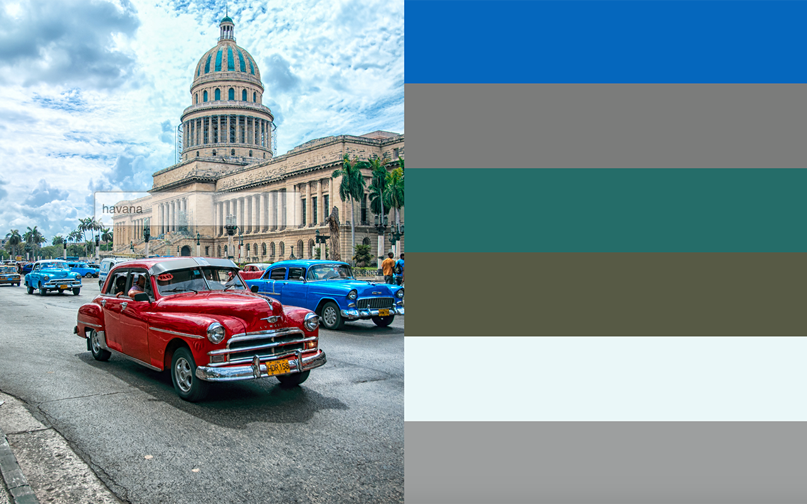
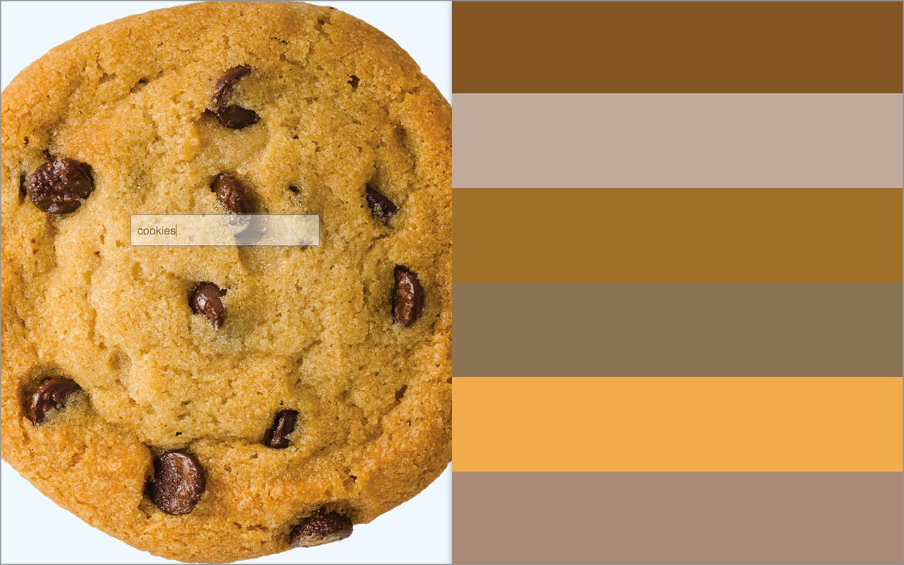

##Color Palette

Enter a keyword to search for an image. A custom color palette is generated based on the results.

Built with [React](https://facebook.github.io/react/) for views & [Backbone](http://backbonejs.org/) for routing, and [Google Custom Image Search API](https://developers.google.com/custom-search/).

This project was originally conceived to be based on search by city, but as the API is Google Custom Search, any keyword search will work (sometimes deliciously).🍪

-🍕